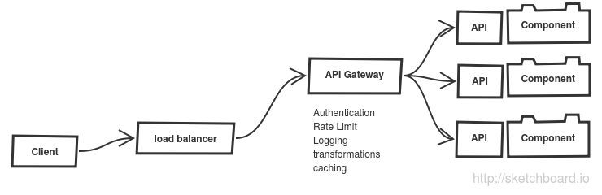

# microservices
microservices design styles

## API Gateway

[Kong](http://getkong.org/)

Open source management layer for APIs built on top of NGINX

[Tyk](https://github.com/lonelycode/tyk)

Tyk is a lightweight, open source API Gateway and enables you to control who accesses your API, when they access it and how they access it. Tyk will also record detailed analytics on how your users are interacting with your API and when things go wrong.
Written in [Go](http://golang.org/) language.

[OpenLoop](http://loopback.io/)

LoopBack is an open source Node.js framework built on top of Express optimized for building APIs for mobile, web, and other devices. Connect to multiple data sources, write business logic in Node.js, glue on top of your existing services and data, connect using JS, iOS & Android SDKs.

**Further reading**

[Build microservices: using an API Gateway.](https://www.nginx.com/blog/building-microservices-using-an-api-gateway/) [Chris Richardson](http://microservices.io/)

## Service

Follow 12 rules when implementing a service using [12 factor methodology](http://12factor.net/)

**CircuitBreaker pattern**

[Martin Fowler](http://martinfowler.com/bliki/CircuitBreaker.html)

CircuitBreaker pattern from Michael Nygard’s book ["Release It! Design and Deploy Production-Ready Software"](http://pragprog.com/book/mnee/release-it)

Microsoft Cloud Design patterns: [Circuit Breaker pattern](https://msdn.microsoft.com/en-us/library/dn589784.aspx)

**Bulkhead pattern**

**Timeout pattern**

## Shared Services

### Service Discovery

### routing

### scheduling 

### logging

### health management

### metrics

### access control

### security
