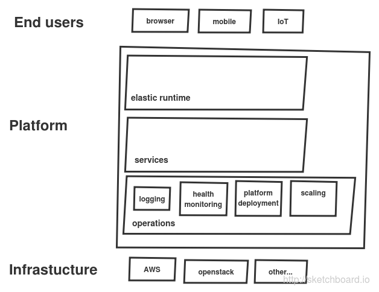

# microservices

##### characteristics (based on [Martin Fowler](http://martinfowler.com/articles/microservices.html#CharacteristicsOfAMicroserviceArchitecture) )

* **Componentization of Services**: component is a unit of software that is independently replaceable and upgradeable.

* **Organized around business capabilities**

* **Products not projects**

* **Smart Endpoints and dump pipes**

* **Decentralized Governance**

* **Decentralized Data Management**

* **Infrastructure Automation**

* **Design for failure**

* **Evolutionary Design**

##### pre requisites for taking up Microservices(based development)
[based on this article by Martin Fowler](http://martinfowler.com/bliki/MicroservicePrerequisites.html)

* **Rapid provisioning**: you should be able to fire up a new server in a matter of hours.

* **Basic Monitoring**: detecting technical issues (counting errors, service availability, etc) but it's also worth monitoring business issues (such as detecting a drop in orders). If a sudden problem appears then you need to ensure you can quickly rollback

* **Rapid Application Deployment**: you need to be able to quickly deploy them, both to test environments and to production.

* **DevOps Culture**: close collaboration between developers and operations- an important organizational shift is needed. 

## microservices design styles

**modern application platform**

### API Gateway

[Kong](http://getkong.org/)

Open source management layer for APIs built on top of NGINX

[Tyk](https://github.com/lonelycode/tyk)

Tyk is a lightweight, open source API Gateway and enables you to control who accesses your API, when they access it and how they access it. Tyk will also record detailed analytics on how your users are interacting with your API and when things go wrong.
Written in [Go](http://golang.org/) language.

[OpenLoop](http://loopback.io/)

LoopBack is an open source Node.js framework built on top of Express optimized for building APIs for mobile, web, and other devices. Connect to multiple data sources, write business logic in Node.js, glue on top of your existing services and data, connect using JS, iOS & Android SDKs.

**Further reading**

[Build microservices: using an API Gateway.](https://www.nginx.com/blog/building-microservices-using-an-api-gateway/) [Chris Richardson](http://microservices.io/)

### Service

Follow 12 rules when implementing a service using [12 factor methodology](http://12factor.net/)

**CircuitBreaker pattern**

[Martin Fowler](http://martinfowler.com/bliki/CircuitBreaker.html)

CircuitBreaker pattern from Michael Nygard’s book ["Release It! Design and Deploy Production-Ready Software"](http://pragprog.com/book/mnee/release-it)

Microsoft Cloud Design patterns: [Circuit Breaker pattern](https://msdn.microsoft.com/en-us/library/dn589784.aspx)

**Bulkhead pattern**

**Timeout pattern**

### Communication between Services

Request/response - sync : binary RPC like [Thrift](https://thrift.apache.org/) or http or Google's [Protocolbuffers](https://github.com/google/protobuf)

Request/response - async: message passing

Event based : messaging middleware like rabbitmq/kafka

### Shared Services

* Service Discovery

* routing

* scheduling 

* logging

* health management

* metrics

* access control and authorization

..* user auth

..* service-to-service auth

* security

### Monitoring 

### Testing

[Testing strategies for microservices development](http://martinfowler.com/articles/microservice-testing/) by [Toby Clemson](http://github.com/tobyclemson)

### References

Sam NewMan. [Answering questions (from Devxx) on Microservices](http://samnewman.io/blog/2015/06/22/answering-questions-from-devoxx-on-microservices/), Jun 22, 2015 	

[Sam Ramji, cloud foundry foundation](https://twitter.com/sramji). [The Makings of a Modern Application Architecture](https://www.youtube.com/watch?v=fiENlfVU7Ys)
